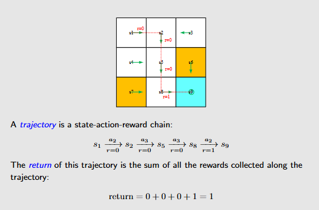
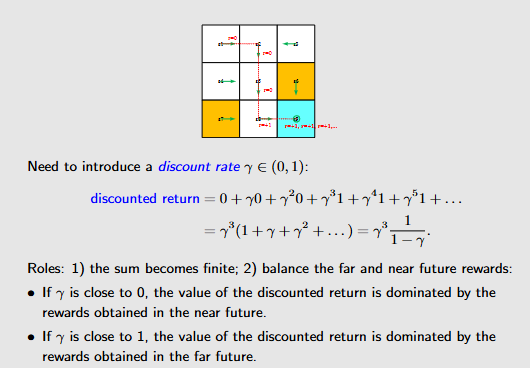
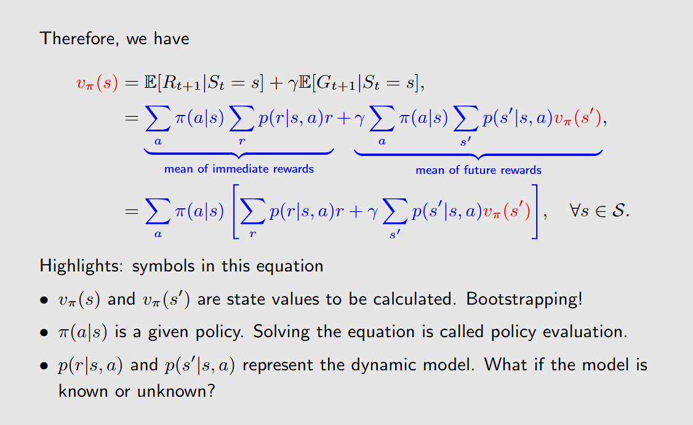
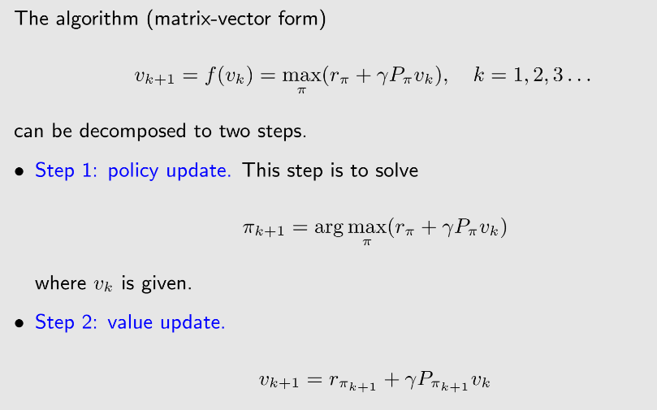
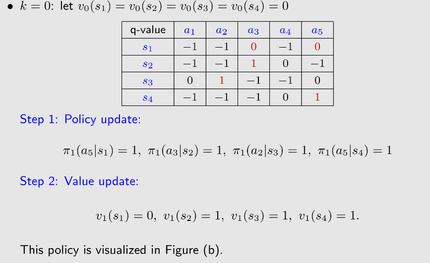
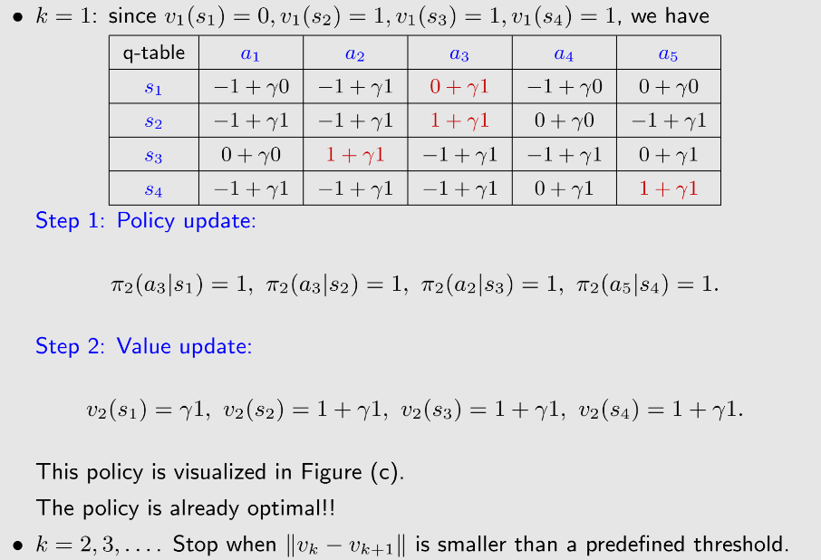
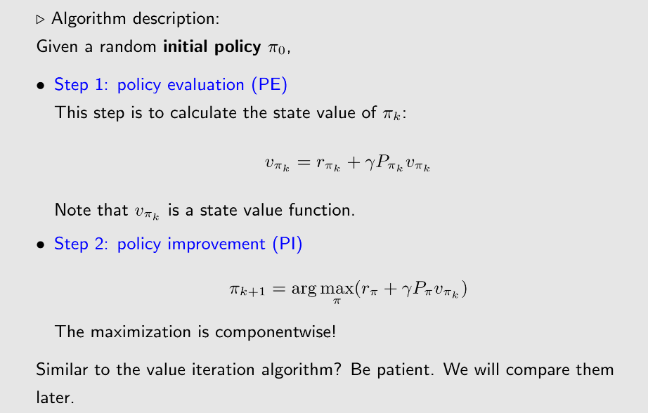

# 1.Basic Concepts 基础概念

- State：状态信息

- State Space：状态空间，所有s的集合

- Action：每个状态下可采取的行动

- State transition：执行动作后，智能体可能从一个状态到另一个状态。定义了和环境的交互信息

- Forbidden area：无法进入或者进入之后会得到惩罚

- State transition probability：用条件概率来表示随机性的状态转移

- **Policy：**$$\pi$$ 策略，告诉智能体在哪个状态下该做出什么动作。用条件概率表示，总和为1 
- **Reward：**采取动作后取得的数字，正数代表奖励，负数代表惩罚。是一个人机交互的手段，可以引导智能体的行为。用条件概率表示，reward取决于目前的状态和当前的行动，和下一个状态无关
- **trajectory：**state-action-reward chain
- **return：**回报， 沿着trajectory所得到的reward总和

- discounted return：为了解决奖励 无法终止的问题引入，$$\gamma$$越大越远视，越小越近视

 

- episode：一次尝试，最终会到达 terminal state 。没有terminal state的程序叫做continuing tasks 。实际上把两种情况同等看待，即把episode转化为continuing tasks：1.把target state 设置为absorbing state 2.仍认为是普通状态

- MDP（markov decision process）框架

  Key elements of MDP:
  • Sets:
  • State: the set of states $S$
  • Action: the set of actions $A(s)$ is associated for state $s ∈ S$.
  • Reward: the set of rewards $R(s, a)$.
  • Probability distribution (or called system model):
  • State transition probability: at state $s$, taking action $a$, the probability to
  transit to state $s′$ is $p(s′|s, a)$
  • Reward probability: at state s, taking action a, the probability to get
  reward $$r$$ is $$p(r|s, a)$$
  • Policy: at state s, the probability to choose action a is $$π(a|s)$$
  • **Markov property: memoryless property**无记忆性的

  $$p(st+1|at, st, . . . , a0, s0) = p(st+1|at, st),\\
  p(rt+1|at, st, . . . , a0, s0) = p(rt+1|at, st).$$
  All the concepts introduced in this lecture can be put in the framework in MDP.

  当policy确定时就变成了Markov process

# 2.Bellman Equation 贝尔曼公式

## State Value

The expectation 期望 (or called expected value or mean) of $G_t$(discounted return) is defined as the state-value function or simply state value:
$$ v_π (s) = E[G_t|S_t = s] $$

## Bellman Equation

### 1. Bellman方程的基本形式

Bellman公式的基本形式可以用以下方程表示：

推导过程暂略

#### 对于状态值函数 $V(s)$：
$$
V(s) = \max_a \left( R(s, a) + \gamma \sum_{s'} P(s'|s, a) V(s') \right)
$$

- $V(s)$：表示从状态 $s$ 开始，智能体能够获得的期望回报。
- $a$：在状态 $s$ 下采取的动作。
- $R(s, a)$：从状态 $s$ 采取动作 $a$ 后获得的即时奖励。
- $\gamma$：折扣因子（$0 \leq \gamma < 1$），表示未来奖励的重要性。**当折扣因子越小则策略越短视**
- $P(s'|s, a)$：状态转移概率，表示从状态 $s$ 采取动作 $a$ 后转移到状态 $s'$ 的概率。
- $s'$：可能的下一状态。

#### 对于动作值函数 $Q(s, a)$：
$$
Q(s, a) = R(s, a) + \gamma \sum_{s'} P(s'|s, a) \max_{a'} Q(s', a')
$$
- $Q(s, a)$：表示从状态 $s$ 开始，采取动作 $a$ 后，能获得的最大期望回报。

# 3.Bellman Optimal Equation（BOE） 

## 公式表示

### 1. 状态值函数形式
$$
V^*(s) = \max_{a \in \mathcal{A}} \left[ \mathcal{R}(s,a) + \gamma \sum_{s' \in \mathcal{S}} \mathcal{P}(s'|s,a) V^*(s') \right]
$$

### 2. 动作值函数形式
$$
Q^*(s,a) = \mathcal{R}(s,a) + \gamma \sum_{s' \in \mathcal{S}} \mathcal{P}(s'|s,a) \max_{a' \in \mathcal{A}} Q^*(s',a')
$$

---

## 符号说明
- $V^*(s)$: 状态 $s$ 的最优状态值函数
- $Q^*(s,a)$: 状态-动作对 $(s,a)$ 的最优动作值函数
- $\mathcal{R}(s,a)$: 即时奖励函数
- $\mathcal{P}(s'|s,a)$: 状态转移概率
- $\gamma$: 折扣因子
- $\mathcal{S}$, $\mathcal{A}$: 状态空间和动作空间

# 4.值迭代与策略迭代

1.值迭代算法

 一个例子

2.策略迭代

